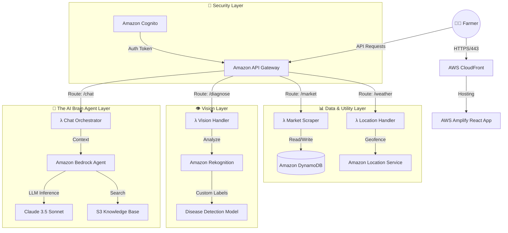

# 🏛️ Technical Design Document: Kishan Vani


## 1. Executive Summary

Kishan Vani is a **Voice-First, Multimodal Agricultural Platform** designed to solve the "Digital Divide" for Indian farmers. Unlike traditional apps that act as static databases, Kishan Vani utilizes **Agentic AI** to actively diagnose crops, analyze market trends, and translate community knowledge in real-time. The system is built on an **Event-Driven Serverless Architecture** on AWS to ensure low latency even in 2G/3G network zones.

---

## 2. High-Level Architecture

The system follows a microservices pattern where the Frontend acts as a "Thin Client," offloading heavy computation (Image Processing, LLM Inference) to the AWS Cloud.



---

## 3. Tech Stack

### Frontend & Hosting

**Framework**: React (Vite) / Next.js
- Modern, component-based UI architecture
- Fast build times with Vite
- Server-side rendering capabilities with Next.js
- Progressive Web App (PWA) support for offline functionality

**Hosting**: AWS Amplify
- Continuous Integration/Continuous Deployment (CI/CD)
- Global content delivery via CloudFront CDN
- Automatic HTTPS and custom domain support
- Branch-based deployments for staging/production
- Edge caching for static assets

**Authentication**: Amazon Cognito
- Secure user registration and login
- Social identity provider integration (Google, Facebook)
- Multi-factor authentication (MFA) support
- User profile management and attributes
- JWT token-based API authorization
- Phone number verification for SMS-based auth

---

## 4. The AI Layer (Core USP)

### 4.1 Kishan Assistant Chat (Agentic AI)

**Service**: Amazon Bedrock Agent with Claude 3.5 Sonnet

**Architecture**:
- **Agentic AI Framework**: Bedrock Agent orchestrates multi-step reasoning
- **RAG (Retrieval-Augmented Generation)** implementation
- **Knowledge Base**: Agricultural PDFs, research papers, government guidelines stored in Amazon S3
- **Vector Store**: Amazon OpenSearch Serverless for semantic search
- **Action Groups**: Lambda functions for dynamic data retrieval (weather, prices, diagnostics)

**Data Flow**:
```
User Query → API Gateway → Lambda (Chat Orchestrator) 
→ Bedrock Agent (Plan & Execute) 
→ OpenSearch (Retrieve relevant documents) 
→ Action Groups (Invoke tools if needed)
→ Claude 3.5 Sonnet (Generate contextual response) 
→ Lambda (Format & Stream response) → User
```

**Agentic Capabilities**:
- **Multi-step reasoning**: Break complex queries into sub-tasks
- **Tool invocation**: Automatically call weather, market, or diagnostic APIs
- **Context retention**: Session management with DynamoDB
- **Self-correction**: Validate responses against knowledge base
- **Streaming responses**: Real-time token generation for better UX

**Features**:
- Context-aware conversations with session management (DynamoDB)
- Multilingual support (Amazon Translate integration)
- Voice input/output via Amazon Polly and Transcribe
- Citation of sources from knowledge base
- Proactive suggestions based on user context (location, crop type, season)

### 4.2 Visual Crop Doctor (Computer Vision)

**Service**: Amazon Rekognition Custom Labels

**Architecture**:
- Custom-trained model for crop disease detection
- Training dataset: 10,000+ labeled images of diseased crops
- Model hosted on Rekognition with auto-scaling inference
- Multi-model support: Separate models for different crop categories

**Data Flow**:
```
Camera/Upload → S3 Bucket (Image Storage) 
→ S3 Event Trigger → Lambda (Image Processor) 
→ Rekognition Custom Labels (Disease Detection) 
→ Lambda (Result Formatter + Treatment Lookup) 
→ Bedrock Agent (Generate treatment plan)
→ DynamoDB (Log Analysis) → API Response → User
```

**Implementation Details**:
- **Image preprocessing**: Resize to 1024x1024, format conversion, quality enhancement
- **Confidence threshold**: 90% minimum for disease identification
- **Fallback mechanism**: If confidence < 90%, route to expert review queue (SQS)
- **Treatment recommendations**: Stored in DynamoDB (disease_id → treatment_plan)
- **Multi-disease detection**: Identify multiple diseases in a single image
- **Severity assessment**: Classify disease progression (early, moderate, severe)
- **Integration with Bedrock**: Generate personalized treatment plans using LLM

### 4.3 Community Translation Engine

**Services**: 
- Amazon Translate (Real-time text translation)
- Amazon Comprehend (Sentiment analysis and language detection)
- Amazon Polly (Text-to-speech for voice posts)
- Amazon Transcribe (Speech-to-text for voice input)

**Architecture**:
- Automatic language detection on post submission
- Parallel translation to all supported languages (English, Hindi, Tamil, Telugu, Kannada, Marathi, Bengali, Gujarati)
- Sentiment analysis to flag urgent/distressed posts
- Translations cached in DynamoDB for performance
- Voice post support with automatic transcription

**Data Flow**:
```
User Post (Text/Voice) → API Gateway → Lambda (Post Handler) 
→ Transcribe (If voice input) 
→ Comprehend (Detect Language + Sentiment + Key Phrases) 
→ Translate (Generate translations in parallel) 
→ DynamoDB (Store post + translations) 
→ SNS (Notify if urgent) 
→ Polly (Generate audio for voice output) → Community Feed
```

**Advanced Features**:
- **Sentiment-based prioritization**: Urgent posts appear first
- **Key phrase extraction**: Automatic tagging for better discoverability
- **Profanity filtering**: Amazon Comprehend PII detection
- **Voice posts**: Farmers can record questions in their native language
- **Audio responses**: Text responses converted to speech for low-literacy users

---

## 5. Data & Logic Layer

### 5.1 Market Price Intelligence

**Service**: AWS Lambda (Node.js) + Amazon DynamoDB + Amazon Bedrock

**Architecture**:
- **Scheduled Lambda functions** (EventBridge cron: every 6 hours)
- **Web scrapers** fetch data from:
  - Government Mandi portals (Agmarknet)
  - Agricultural market APIs
  - MSP databases
  - Commodity exchanges (NCDEX, MCX)
- **Single-table DynamoDB design**:
  - PK: `CROP#<crop_name>`
  - SK: `PRICE#<date>#<market_location>`
  - Attributes: msp, local_price, trend, timestamp, demand_index
- **AI-powered insights**: Bedrock analyzes price trends and generates recommendations

**Data Flow**:
```
EventBridge (Schedule) → Lambda (Scraper) 
→ External Mandi APIs → Lambda (Data Processor) 
→ DynamoDB (Store prices) 
→ Lambda (Trend Calculator + AI Analyzer) 
→ Bedrock (Generate insights) 
→ API Gateway → User Dashboard
```

**Features**:
- **Historical price tracking** (90 days with trend analysis)
- **Predictive analytics**: ML-based price forecasting
- **Trend calculation**: Moving averages, seasonal patterns
- **Price alert triggers** (SNS) when favorable conditions detected
- **Optimal selling time recommendations**: AI suggests best time to sell
- **Market comparison**: Compare prices across multiple mandis
- **Demand forecasting**: Predict future demand based on historical data

### 5.2 Weather & Location Services

**Service**: Amazon Location Service + AWS IoT (Future)

**Architecture**:
- **Map tiles** for dashboard visualization (Ghaziabad, rural areas)
- **Geofencing capabilities** for region-specific alerts
- **Integration with weather APIs**: OpenWeatherMap, IMD (India Meteorological Department)
- **Reverse geocoding** for location name display
- **Hyperlocal weather**: Combine API data with IoT sensor data (Phase 2)

**Data Flow**:
```
User GPS → API Gateway → Lambda (Location Handler) 
→ Location Service (Reverse Geocode + Geofence Check) 
→ Weather API (Fetch conditions) 
→ DynamoDB (Cache weather data) 
→ Bedrock (Generate farming recommendations) → User Dashboard
```

**Features**:
- **7-day weather forecast** with hourly breakdown
- **Rainfall predictions** for irrigation planning
- **Extreme weather alerts** (heatwaves, storms, frost)
- **Crop-specific recommendations**: AI suggests actions based on weather
- **Geofenced alerts**: Region-specific notifications (e.g., "Heavy rain expected in your area")
- **Historical weather data**: Compare current season with past years
- **Soil moisture predictions**: Estimate irrigation needs

---

## 6. Notification System

**Service**: Amazon SNS (Simple Notification Service) + Amazon Pinpoint

**Use Cases**:
- Disease outbreak alerts in user's region
- Critical weather warnings (frost, drought, heatwave)
- Market price alerts (favorable selling conditions)
- Community post responses
- Personalized farming tips based on crop calendar

**Architecture**:
- **Topic-based subscriptions** (by region, crop type, language)
- **SMS delivery** for low-connectivity users (via SNS)
- **Push notifications** via mobile app (via Pinpoint)
- **Email notifications** for detailed reports
- **Voice calls** for critical alerts (via Amazon Connect)
- **WhatsApp integration** (via Pinpoint)

**Smart Notification Logic**:
```
Event Trigger → Lambda (Notification Handler) 
→ DynamoDB (User Preferences) 
→ Bedrock (Personalize message) 
→ SNS/Pinpoint (Deliver via preferred channel) → User
```

**Features**:
- **Multi-channel delivery**: SMS, Push, Email, Voice, WhatsApp
- **Personalization**: AI-generated messages based on user context
- **Delivery optimization**: Choose channel based on connectivity
- **Notification scheduling**: Avoid sending during night hours
- **Delivery tracking**: Monitor open rates and engagement

---

## 7. Complete Data Flow: Image Analysis Journey

### Step-by-Step Flow

1. **User Captures Image**
   - Frontend: React Camera component captures crop photo
   - Image compressed to <2MB for faster upload (client-side compression)
   - Optional: Voice description recorded alongside image

2. **Upload to S3**
   - API Gateway → Lambda (Pre-signed URL Generator)
   - Frontend uploads directly to S3 bucket: `kishan-vani-crop-images`
   - S3 object key: `user_id/timestamp_crop_type.jpg`
   - Metadata: GPS coordinates, crop type, user description

3. **Trigger Analysis**
   - S3 Event Notification → Lambda (Image Processor)
   - Lambda validates image (format, size, content quality)
   - Image preprocessing: Resize, enhance, normalize

4. **Disease Detection**
   - Lambda invokes Rekognition Custom Labels endpoint
   - Model analyzes image and returns:
     ```json
     {
       "disease": "Fungal Infection - Powdery Mildew",
       "confidence": 94.5,
       "affected_area": "leaves",
       "severity": "moderate",
       "bounding_boxes": [...],
       "alternative_diagnoses": [...]
     }
     ```

5. **AI-Powered Treatment Generation**
   - Lambda invokes Bedrock Agent with detection results
   - Agent retrieves context from knowledge base
   - Agent considers: crop type, location, season, weather, user history
   - Generates personalized treatment plan with:
     - Immediate actions (next 24 hours)
     - Short-term treatment (1-2 weeks)
     - Preventive measures
     - Organic and chemical alternatives
     - Cost estimates
     - Nearby suppliers

6. **Response to User**
   - Lambda formats response with:
     - Disease name and description (multilingual)
     - Confidence score with visual indicator
     - Treatment steps (immediate, short-term, preventive)
     - Related articles from knowledge base
     - Similar cases from community
     - Voice output option (via Polly)
   - API Gateway returns JSON to frontend
   - Frontend displays diagnosis card with visual indicators

7. **Logging & Analytics**
   - Analysis logged to DynamoDB: `crop_analyses` table
   - CloudWatch metrics: detection_latency, confidence_distribution
   - User feedback collected for model improvement
   - Data used for model retraining and performance monitoring
   - Regional disease outbreak tracking

**Total Latency**: <3 seconds (requirement met)
**Offline Support**: Cached responses for common diseases

---

## 8. Database Design

### DynamoDB Tables (Single-Table Design)

**1. users**
- PK: `USER#<user_id>`
- SK: `PROFILE`
- Attributes: name, phone, location, crops_grown, language_preference, farm_size, notification_preferences
- GSI1: `LOCATION#<state>#<district>` (for regional queries)

**2. crop_analyses**
- PK: `USER#<user_id>`
- SK: `ANALYSIS#<timestamp>`
- Attributes: image_url, disease, confidence, treatment_applied, feedback, severity, crop_type
- GSI1: `DISEASE#<disease_name>#<timestamp>` (for outbreak tracking)

**3. community_posts**
- PK: `POST#<post_id>`
- SK: `LANG#<language_code>`
- Attributes: original_text, translated_text, sentiment, upvotes, author_id, tags, audio_url
- GSI1: `SENTIMENT#<score>#<timestamp>` (for urgent post prioritization)

**4. market_prices**
- PK: `CROP#<crop_name>`
- SK: `PRICE#<date>#<location>`
- Attributes: msp, local_price, trend_percentage, demand_index, source
- GSI1: `LOCATION#<state>#<date>` (for regional price comparison)

**5. chat_sessions**
- PK: `USER#<user_id>`
- SK: `SESSION#<session_id>`
- Attributes: messages[], last_updated, context, agent_state, tool_invocations
- TTL: Auto-expire after 30 days

**6. disease_treatments**
- PK: `DISEASE#<disease_name>`
- SK: `TREATMENT#<version>`
- Attributes: description, symptoms, immediate_actions, short_term_plan, preventive_measures, organic_options, chemical_options, cost_estimate

**7. knowledge_base_metadata**
- PK: `DOCUMENT#<doc_id>`
- SK: `METADATA`
- Attributes: title, source, language, category, upload_date, vector_id
- Used for tracking documents in S3 knowledge base

---

## 9. Security Architecture

### Authentication Flow
```
User Login (Phone/Email) → Cognito User Pool → JWT Token 
→ API Gateway (Lambda Authorizer) → Verify Token + User Context 
→ Access Granted with Scoped Permissions
```

### Data Protection
- **S3 bucket encryption**: AES-256 (server-side) with AWS KMS
- **DynamoDB encryption at rest**: AWS managed keys
- **API Gateway**: TLS 1.3 only, certificate pinning
- **Secrets Manager**: Store API keys, database credentials, third-party tokens
- **Data residency**: All data stored in AWS Asia Pacific (Mumbai) region
- **PII protection**: Amazon Macie for sensitive data discovery

### Access Control
- **IAM roles** with least privilege principle
- **Lambda execution roles** scoped per function
- **S3 bucket policies**: Deny public access, enforce encryption
- **VPC endpoints** for private service communication
- **Resource-based policies**: Fine-grained access control
- **Cognito user groups**: Role-based access (farmer, expert, admin)

### Compliance & Privacy
- **GDPR compliance**: User data deletion on request
- **Data retention policies**: Automated cleanup of old data
- **Audit logging**: CloudTrail for all API calls
- **Penetration testing**: Regular security assessments
- **WAF (Web Application Firewall)**: Protect against common attacks

---

## 10. Monitoring & Observability

**Services**:
- **Amazon CloudWatch**: Logs, metrics, dashboards, alarms
- **AWS X-Ray**: Distributed tracing for Lambda functions
- **CloudWatch Alarms**: Latency spikes, error rates, cost anomalies
- **CloudWatch Insights**: Log analysis and pattern detection
- **AWS Cost Explorer**: Cost monitoring and optimization

**Key Metrics**:
- **API Gateway**: Request count, 4xx/5xx errors, latency (p50, p95, p99)
- **Lambda**: Invocation count, duration, concurrent executions, cold starts, memory usage
- **Rekognition**: Inference time, confidence distribution, model accuracy
- **DynamoDB**: Read/write capacity, throttled requests, item sizes
- **Bedrock**: Token usage, latency, cost per request
- **S3**: Storage size, request count, data transfer

**Custom Dashboards**:
- **User engagement**: Active users, feature usage, session duration
- **AI performance**: Disease detection accuracy, chat response quality
- **System health**: Error rates, latency trends, availability
- **Business metrics**: Cost per user, revenue (if applicable), user retention

**Alerting Strategy**:
- **Critical alerts**: System downtime, security breaches (PagerDuty integration)
- **Warning alerts**: High latency, increased error rates (SNS to ops team)
- **Info alerts**: Cost anomalies, usage spikes (Email notifications)

---

## 11. Cost Optimization

### Optimization Strategies
- **Lambda**: Pay-per-invocation, no idle costs, ARM64 Graviton2 processors (20% cost savings)
- **DynamoDB**: On-demand pricing for unpredictable traffic, reserved capacity for predictable workloads
- **S3**: Lifecycle policies (move old images to S3 Glacier after 90 days, delete after 1 year)
- **Rekognition**: Stop inference endpoint when not in use, batch processing for non-urgent requests
- **CloudFront**: Cache static assets (TTL: 24 hours), reduce origin requests
- **Bedrock**: Token optimization, response caching, prompt engineering for conciseness
- **OpenSearch**: Use t3.small instances for dev, scale up for production

### Cost Monitoring
- **AWS Cost Explorer**: Daily cost tracking with anomaly detection
- **Budget alerts**: SNS notifications when costs exceed thresholds
- **Resource tagging**: Track costs by feature (chat, vision, market)
- **Right-sizing**: Regular review of Lambda memory, DynamoDB capacity

**Estimated Monthly Cost** (10,000 active users):
- Amplify Hosting: $15
- Lambda (optimized): $40
- DynamoDB: $75
- Rekognition: $200
- Bedrock (Claude 3.5 Sonnet): $180
- OpenSearch Serverless: $100
- S3 + CloudFront: $30
- Location Service: $20
- SNS + Pinpoint: $25
- Translate + Transcribe + Polly: $50
- **Total**: ~$735/month (~$0.07 per active user)

**Cost Scaling** (100,000 active users):
- Estimated: ~$4,500/month (~$0.045 per active user)
- Economies of scale with reserved capacity and volume discounts

---

## 12. Scalability Strategy

### Auto-Scaling Components
- **Lambda**: Automatic concurrency scaling (up to 1,000 concurrent executions per region)
- **DynamoDB**: On-demand mode scales automatically, provisioned mode with auto-scaling
- **API Gateway**: Handles millions of requests per second
- **Rekognition**: Auto-scales inference capacity based on demand
- **OpenSearch**: Automatic scaling of compute and storage
- **Bedrock**: Managed scaling, no infrastructure management

### Performance Optimization
- **CloudFront CDN**: Reduce latency for global users (edge locations in India)
- **DynamoDB DAX**: In-memory cache for hot data (market prices, weather)
- **Lambda@Edge**: Run code closer to users (authentication, routing)
- **S3 Transfer Acceleration**: Faster image uploads from remote areas
- **API Gateway caching**: Cache responses for 5 minutes (weather, prices)
- **Connection pooling**: Reuse database connections in Lambda
- **Async processing**: Use SQS for non-urgent tasks (analytics, reporting)

### Load Testing
- **AWS Load Testing**: Simulate 10,000 concurrent users
- **Chaos engineering**: Test failure scenarios (service outages, network issues)
- **Performance benchmarks**: <3s for image analysis, <1s for chat responses

---

## 13. Deployment Architecture

### CI/CD Pipeline
```
GitHub Repository → AWS CodePipeline 
→ CodeBuild (Run Tests + Linting) 
→ Deploy to Dev (Auto) 
→ Integration Tests 
→ Deploy to Staging (Auto) 
→ Manual Approval 
→ Deploy to Production (Blue/Green) 
→ Smoke Tests → Route Traffic
```

### Infrastructure as Code
- **AWS CDK (Cloud Development Kit)** for infrastructure provisioning (TypeScript)
- **Separate stacks** for dev, staging, production
- **Automated rollback** on deployment failures (CloudWatch alarms)
- **Version control**: All infrastructure code in Git
- **Drift detection**: Detect manual changes to infrastructure

### Environments
- **Development**: Reduced capacity, shared resources, mock external APIs
- **Staging**: Production-like for testing, real external APIs
- **Production**: Full capacity, multi-AZ deployment, auto-scaling enabled

### Deployment Strategies
- **Blue/Green deployment**: Zero-downtime deployments
- **Canary releases**: Gradual rollout to 10% → 50% → 100% of users
- **Feature flags**: Enable/disable features without redeployment (AWS AppConfig)
- **Rollback mechanism**: Automatic rollback on error rate spike

---

## 14. Future Enhancements (Phase 2)

### IoT Integration
- **AWS IoT Core**: Connect soil moisture sensors, weather stations, pH sensors
- **Real-time field monitoring dashboard**: Live sensor data visualization
- **Automated irrigation triggers**: Smart irrigation based on sensor data + weather forecast
- **Predictive maintenance**: Alert farmers about equipment issues before failure
- **IoT Analytics**: Process and analyze sensor data at scale

### Advanced Analytics & ML
- **Amazon QuickSight**: Business intelligence dashboards for government agencies
- **Predictive crop yield modeling**: SageMaker models for yield forecasting
- **Disease outbreak prediction**: Early warning system using historical data
- **Personalized recommendations**: ML-based crop selection, planting schedules
- **Fraud detection**: Identify fake products, price manipulation

### Blockchain Integration (Amazon Managed Blockchain)
- **Transparent supply chain tracking**: Farm to consumer traceability
- **Verified organic certification**: Immutable certification records
- **Fair trade price guarantees**: Smart contracts for farmer payments
- **Crop insurance**: Automated claims processing based on weather data

### Social Commerce
- **Direct farmer-to-consumer marketplace**: Eliminate middlemen
- **Group buying**: Farmers pool resources for bulk purchases
- **Equipment rental**: Share expensive machinery within community
- **Micro-loans**: AI-powered credit scoring for farmer loans

### Drone Integration
- **Aerial crop monitoring**: Detect diseases from drone imagery
- **Precision agriculture**: Variable rate application of fertilizers
- **Crop health mapping**: NDVI analysis for field health assessment

### Voice-First Expansion
- **Alexa Skill**: "Alexa, ask Kishan Vani about wheat prices"
- **IVR system**: Call-based access for feature phone users
- **Voice-only mode**: Complete app functionality via voice commands
